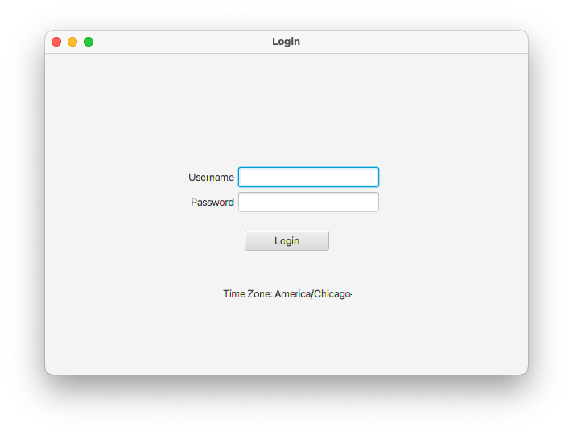
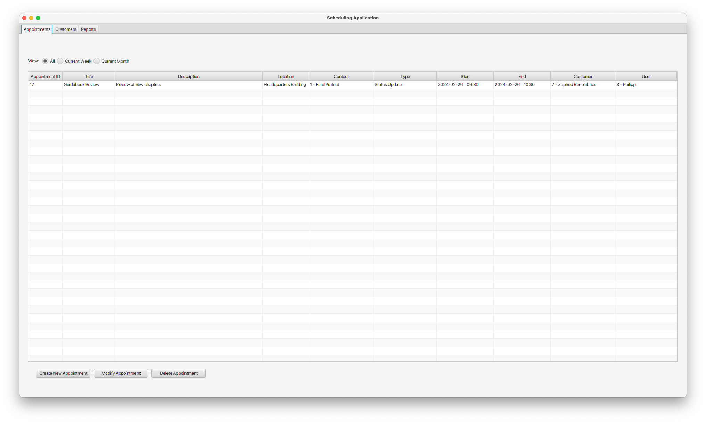
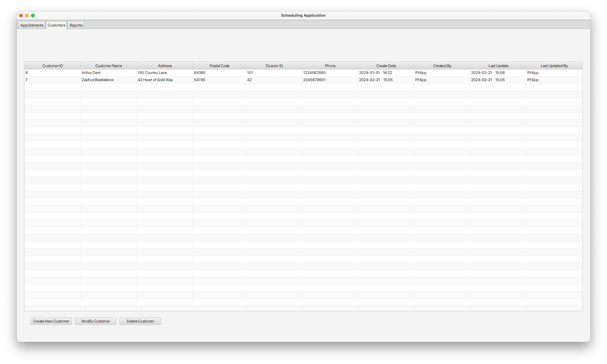
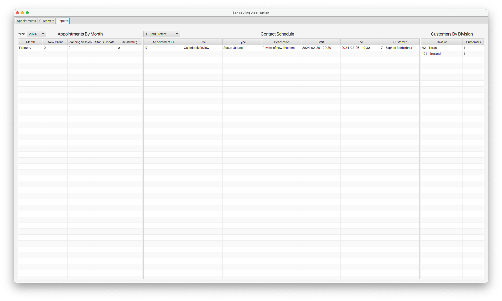
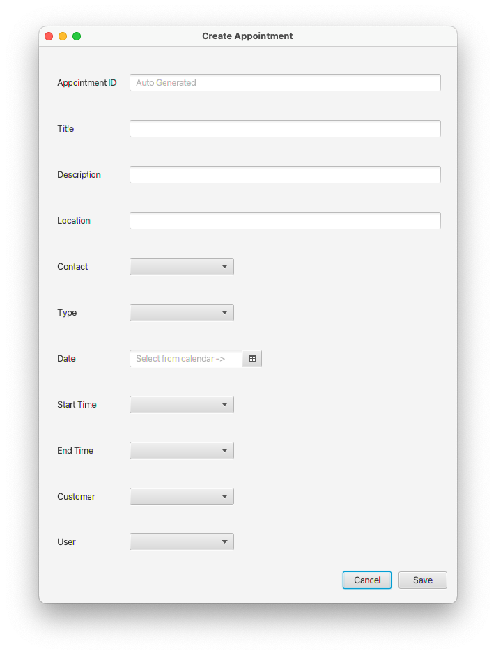
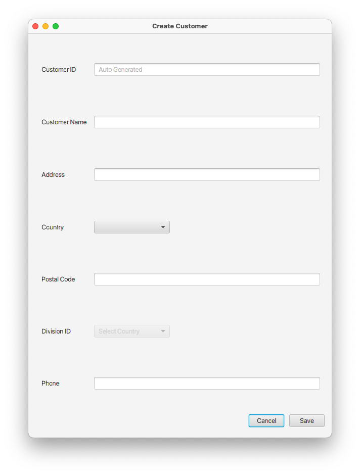
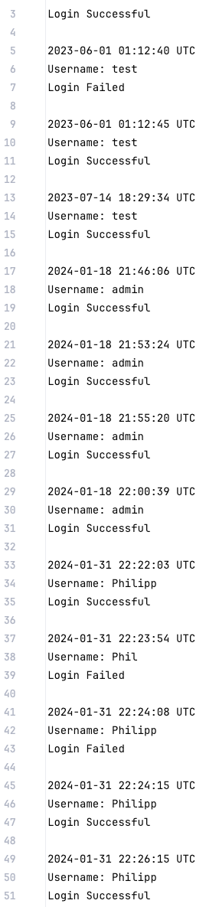

# Appointment Manager

## Overview

The Appointment Manager is a desktop application developed with JavaFX for managing appointments and customer data. It integrates with a relational database for storing and retrieving data, supporting functionalities essential for scheduling tasks. The application includes internationalization features to accommodate users from different locales.

## Major Features

- **Appointment Management**: Facilitates adding, modifying, and deleting appointments with form validation and scheduling logic.
- **Customer Management**: Allows for the detailed management of customer information, including contact details and associated appointments.
- **Report Generation**: Generates reports to allow users to view a summary of appointments by month, contact schedules, and customers by division.
- **Login System**: Implements a user authentication system to ensure that only authorized personnel can access the application.
- **Logging**: Stores a list of successful and unsuccesful login attempts for auditing purposes.
- **Localization and Internationalization**: Automatically adapts to different time zones and languages, supporting users who speak English and French.
- **Alerts and Notifications**: Implements a notification system to inform users about upcoming appointments.

## Programming Concepts

- **Object-Oriented Design**: The application employs object-oriented design principles to improve modularity, reusability, readability, and ease of maintenance.
- **MVC Architecture**: Adheres to the Model-View-Controller pattern, separating the user interface, data manipulation, and control logic.
- **Database Connectivity**: Utilizes JDBC for database connectivity and transaction management.
- **Data Access Objects (DAO)**: Implements DAOs for abstracting and encapsulating all access to the data source.
- **Exception Handling**: Employs exception handling to gracefully manage runtime errors.
- **Lambda Functions**: Lambda functions are utilized throughout the code as appropriate to improve code readability and conciseness.
- **JavaFX for UI**: Utilizes JavaFX to build a user-friendly graphical user interface.
- **JavaDocs Documentation**: Utilizes JavaDocs to thoroughly document the codebase, ensuring clarity and ease of maintenance with detailed class and method descriptions accessible through generated HTML pages.

## Screenshots

    
     <b>Figure 1.</b> Login Screen

---

    
     <b>Figure 2.</b> Appointments Tab

---

    
     <b>Figure 3.</b> Customers Tab

---

    
     <b>Figure 4.</b> Reports Tab

---

    
     <b>Figure 5.</b> Create Appointment Form

---

    
     <b>Figure 6.</b> Create Customer Form

---

    
     <b>Figure 7.</b> Login History

